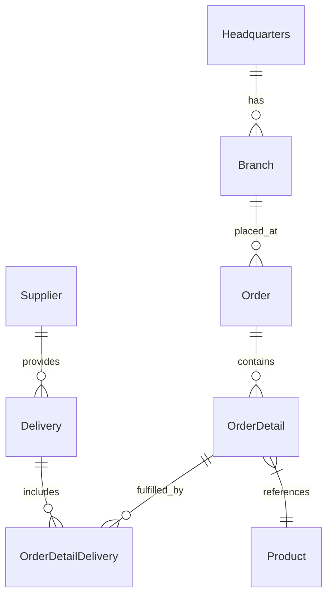

# OctoCAT Supply — Complete Repository & Project Specification

> **Audience:** Human developers **and** AI coding agents.
> **Purpose:** This is the single source of truth for how this repository is structured, which patterns and technologies are used, and the rules that MUST be followed to guarantee deterministic, consistent behaviour for all future development.
> **Status:** Authoritative. If any other document contradicts this spec, this spec wins — unless the contradiction is a `.github/instructions/*` file, which is equally authoritative and more granular.

---

## 1. Project Identity

| Field | Value |
|-------|-------|
| Product name | OctoCAT Supply Chain Management System |
| Repository | `zjaveed-sand-org/agent_java_demo` |
| Repository ID | `1075326449` |
| Default branch | `main` |
| Visibility | Public |
| License | MIT |
| Purpose | Demo application showcasing GitHub Copilot, GHAS, MCP, and AI-assisted development across a full-stack app |

**What this is:** A supply chain management demo app with a **Java / Spring Boot REST API backend** and a **React + TypeScript frontend**. It models a fictional smart-cat-products supply chain (Headquarters → Branches → Orders → Products → Suppliers → Deliveries). It exists primarily as a teaching/demo vehicle, so **clarity and consistency matter more than cleverness**.

---

## 2. Technology Stack (authoritative versions)

### Backend (`/api`)
- **Language:** Java **23+** (`java.version` = 23 in `pom.xml`)
- **Framework:** Spring Boot **3.2.4** (`spring-boot-starter-parent`)
- **Build tool:** Maven
- **Base package:** `com.github.av2.api`
- **Port:** `3000`
- **Key libraries:**
  - `spring-boot-starter-web` — REST endpoints (Spring MVC)
  - `springdoc-openapi-starter-webmvc-ui` **2.3.0** — Swagger / OpenAPI UI
  - `spring-boot-starter-validation` — Jakarta Bean Validation
  - `lombok` **1.18.30** — boilerplate reduction (`@Data`, `@NoArgsConstructor`, `@AllArgsConstructor`)
  - `spring-boot-starter-test` — testing (JUnit 5 + Spring Test)
  - OpenClover **4.5.0** — code coverage (via `coverage` Maven profile)

### Frontend (`/frontend`)
- **Language:** TypeScript **~5.7.2** (strict mode expected)
- **Framework:** React **18.3.1**
- **Build tool:** Vite **6.x**
- **Styling:** Tailwind CSS **3.3+** (+ PostCSS, Autoprefixer)
- **Port:** `5137` (dev), `80`/`443` (production via nginx)
- **Key libraries:**
  - `react-router-dom` **7.x** — routing
  - `axios` **1.8.4** — HTTP client
  - `react-query` **3.39.3** — server state
  - `react-slick` / `slick-carousel` — carousels
- **Testing:** Vitest **3.x** + Testing Library + jsdom
- **Linting:** ESLint **9.x** with `typescript-eslint`

### DevOps / Tooling
- **Containerization:** Docker + `docker-compose.yml` (API image built from `eclipse-temurin` JRE; frontend served via nginx)
- **Monorepo runner:** root `package.json` uses npm **workspaces** (`frontend` only) + `concurrently`
- **Node:** `>=18` required at root; CI uses Node 22 and Java 23 (Temurin)
- **Runtime environments supported:** local, GitHub Codespaces, containers

> ⚠️ **Documentation drift warning:** The legacy `docs/architecture.md`, `README.md` (partially), and `docs/tao.md` describe an **Express.js / TypeScript backend** and a "TAO" TypeScript observability framework. **These are outdated.** The backend is now **Java + Spring Boot**. Trust this specification and `.github/instructions/api.instructions.md`, not the older Express references.

---

## 3. Repository Structure

```text
agent_java_demo/
├── api/                              # Java Spring Boot backend
│   ├── pom.xml                       # Maven build, dependencies, profiles (dev/coverage)
│   ├── Dockerfile                    # Multi-stage build (maven -> temurin JRE)
│   └── src/
│       ├── main/java/com/github/av2/api/
│       │   ├── JavaApiApplication.java   # @SpringBootApplication entry point
│       │   ├── config/                   # WebConfig (CORS), OpenApiConfig (Swagger)
│       │   ├── controller/               # @RestController REST endpoints (thin)
│       │   ├── service/                  # @Service business logic (in-memory)
│       │   ├── model/                    # POJO entities (Lombok @Data)
│       │   └── data/                     # SeedData — @Component in-memory seed store
│       └── test/java/com/github/av2/api/ # JUnit 5 tests mirroring main packages
├── frontend/                         # React + TypeScript + Vite frontend
│   ├── src/
│   │   ├── App.tsx                   # Routes + Providers (Auth, Theme)
│   │   ├── main.tsx                  # React entry point
│   │   ├── api/config.ts             # API base URL resolution + endpoint map
│   │   ├── components/               # UI components (+ admin/, entity/ subtrees)
│   │   ├── context/                  # AuthContext, ThemeContext
│   │   └── assets/
│   ├── Dockerfile, nginx.conf, entrypoint.sh
│   ├── vite.config.ts                # dev server on port 5137
│   └── tailwind.config.js, tsconfig*.json, eslint.config.js
├── docs/                             # Project documentation (this file lives here)
├── specification/                    # Mirror copy of this specification
├── infra/                            # Infrastructure-as-code
├── .devcontainer/                    # Codespaces / dev container config
├── .github/
│   ├── copilot-instructions.md       # Top-level agent instructions
│   ├── instructions/                 # Granular, path-scoped rules (MUST read)
│   │   ├── api.instructions.md        # applyTo: api/**/*
│   │   ├── frontend.instructions.md   # applyTo: frontend/**/*
│   │   ├── docs.instructions.md
│   │   └── AGENTS.md
│   └── workflows/copilot-setup-steps.yml
├── docker-compose.yml                # api (3000) + frontend (3001->80)
└── package.json                      # Root workspace scripts (build/dev/test)
```

---

## 4. Architecture

### 4.1 High-level shape
Classic **two-tier client/server** architecture:

```text
[ React SPA (Vite, :5137) ]  --HTTP/REST/JSON-->  [ Spring Boot API (:3000) ]  -->  [ In-memory SeedData store ]
```

- The frontend is a **Single Page Application**. It resolves the API base URL at runtime (`frontend/src/api/config.ts`) supporting local, Codespaces, and injected `RUNTIME_CONFIG`.
- The backend is a **stateless REST API** using an **in-memory data store** (no database). All data is seeded on startup by `SeedData` (`@PostConstruct`).

### 4.2 Backend architectural pattern — **Layered (Controller → Service → Model) with in-memory repository**

This is the single most important pattern to preserve. Every entity follows the **same three-layer shape**:

```text
Controller (@RestController)   ->  thin HTTP layer, maps requests to service calls, returns ResponseEntity
   │
   ▼
Service (@Service)             ->  business logic, owns an in-memory List        , seeded from SeedData
   │
   ▼
Model (POJO + Lombok @Data)    ->  plain data entity, no behaviour
```

- **Dependency injection:** Constructor injection **only**. Field injection (`@Autowired` on fields) is **forbidden**.
- **Data source:** `SeedData` (`@Component`) builds all entity collections once at startup and exposes defensive copies via getters. Services copy this seed data into their own `List<>` on construction.
- **No persistence layer / no database** currently exists. If one is added, it must be introduced as a repository abstraction behind the existing service interfaces — controllers and models must not change shape.

### 4.3 Domain model (ERD)



**Entities (8):** `Headquarters`, `Branch`, `Order`, `OrderDetail`, `OrderDetailDelivery`, `Product`, `Supplier`, `Delivery`. Each has a matching Controller and Service.

### 4.4 REST API surface

Base path convention: `/api/<plural-noun>`. Confirmed endpoints (from `frontend/src/api/config.ts` and controllers):

| Entity | Endpoint |
|--------|----------|
| Products | `/api/products` |
| Suppliers | `/api/suppliers` |
| Orders | `/api/orders` |
| Branches | `/api/branches` |
| Headquarters | `/api/headquarters` |
| Deliveries | `/api/deliveries` |
| Order Details | `/api/order-details` |
| Order Detail Deliveries | `/api/order-detail-deliveries` |

Standard CRUD per entity (`ProductController` is the reference implementation):
- `GET /api/products` → list all
- `GET /api/products/{id}` → 200 or 404
- `POST /api/products` → 201 Created
- `PUT /api/products/{id}` → 200 or 404
- `DELETE /api/products/{id}` → 204 or 404

- **OpenAPI/Swagger:** Configured in `OpenApiConfig`; controllers annotated with `@Tag`, `@Operation`, `@ApiResponse`.
- **CORS:** Configured centrally in `WebConfig` — allows `localhost:5137`, `localhost:3001`, and `*.app.github.dev`. Add new origins here only.

### 4.5 Frontend architecture
- **Entry:** `main.tsx` → `App.tsx`.
- **Providers:** `AuthProvider` and `ThemeProvider` wrap the app (Context API for cross-cutting state — auth, dark mode).
- **Routing:** `react-router-dom` in `App.tsx`. Routes: `/`, `/about`, `/products`, `/login`, `/admin/products`.
- **Components:** Functional components + hooks only. Organized under `components/` with `admin/` and `entity/` subtrees.
- **API access:** Centralized in `src/api/config.ts` (base URL + endpoint map). `axios` is the HTTP client.

---

## 5. How to Build, Run, and Test (deterministic commands)

All commands are run from the **repository root** unless stated. These come from the root `package.json`.

### Prerequisites
- Node.js **>= 18** (CI uses 22), npm
- Java **23+**, Maven
- Docker/Podman (optional, for containers)

### Install
```bash
npm install
```

### Build
```bash
# Build BOTH api (mvn clean package) and frontend (vite build)
npm run build
```

### Run (development)
```bash
# Run both concurrently
npm run dev

# Or individually
npm run dev:api        # cd api && mvn spring-boot:run   (port 3000)
npm run dev:frontend   # vite dev server                (port 5137)
```

### Test
```bash
npm run test           # cd api && mvn test  (API tests)
npm run coverage       # cd api && mvn test clover:clover (OpenClover coverage)
npm run lint           # frontend ESLint
```

### Docker
```bash
docker-compose up --build   # api on :3000, frontend on :3001
```

> ⚠️ **Known documentation inconsistencies to be aware of (do NOT blindly copy):**
> - `.github/copilot-instructions.md` references `npm run test:api`, but the root `package.json` script is actually `npm run test`. Use `npm run test`.
> - `docs/build.md` still references a Python API and contains an **unresolved Git merge conflict marker** (`<<<<<<< HEAD`). Ignore the Python/Express references; the API is Java.
> - `Dockerfile` in `/api` uses Temurin **21** while `pom.xml` targets Java **23**. Prefer Java 23 for local dev; if the container build fails, this version mismatch is the first thing to check.

---

## 6. Coding Standards — DO / DON'T

These rules are **binding**. They are derived from `.github/instructions/*` and the existing code. Follow them to keep behaviour deterministic.

### 6.1 Backend (Java) — DO
- ✅ Keep the **Controller → Service → Model** layering for every entity.
- ✅ Use **constructor injection** for all dependencies.
- ✅ 4-space indentation, max 120 chars/line, always use braces.
- ✅ Naming: Classes `PascalCase`, methods/vars `camelCase`, constants `UPPER_SNAKE_CASE`, packages lowercase.
- ✅ Thin controllers: delegate to services; return correct HTTP status codes (200/201/204/400/404/500).
- ✅ Use `Optional<T>` for lookups that may miss; return empty collections, never `null`.
- ✅ Use Java Streams for collection operations; use `ConcurrentHashMap`/defensive copies for shared mutable state.
- ✅ Validate input with Jakarta Bean Validation (`@NotNull`, `@NotBlank`, `@Min`, `@Size`).
- ✅ Annotate endpoints with OpenAPI (`@Tag`, `@Operation`, `@ApiResponse`) and add JavaDoc to public methods.
- ✅ Keep model classes as plain data holders using Lombok (`@Data`, `@NoArgsConstructor`, `@AllArgsConstructor`).
- ✅ Write JUnit 5 tests (AAA pattern, descriptive names like `shouldReturnProductWhenIdExists`); target 80%+ coverage.

### 6.2 Backend (Java) — DON'T
- ❌ **No field injection** (`@Autowired` on a field).
- ❌ Don't put business logic in controllers.
- ❌ Don't catch generic `Exception` or swallow exceptions silently.
- ❌ Don't return `null` collections.
- ❌ Don't add a database or new framework without an explicit spec update (see §8).
- ❌ Don't change existing REST paths or entity JSON shapes (frontend depends on `/api/...` map).
- ❌ Don't put coverage-excluded logic in `model/**` expecting it to be tested — models are excluded from coverage by design.

### 6.3 Frontend (React/TS) — DO
- ✅ Functional components + hooks only.
- ✅ Strict TypeScript; define interfaces/types for all props and state.
- ✅ Naming: Components `PascalCase`, hooks `useX`, utilities `camelCase`, constants `UPPER_SNAKE_CASE`.
- ✅ Centralize API access through `src/api/config.ts`; always handle loading and error states.
- ✅ Use Context API (Auth, Theme) for cross-cutting state; avoid prop drilling.
- ✅ Tailwind utility-first styling; mobile-first responsive; support dark mode.
- ✅ Accessibility: semantic HTML, ARIA labels, keyboard nav.
- ✅ **i18n for all user-facing text** — support **English, German, Spanish, Chinese** via translation keys (see `frontend.instructions.md`). Never hardcode display strings.
- ✅ Co-locate tests (`*.test.tsx`); mock API calls; target 80%+ coverage.

### 6.4 Frontend (React/TS) — DON'T
- ❌ No `any` types (use `unknown` + narrowing).
- ❌ No hardcoded user-facing strings (use i18n keys).
- ❌ No inline styles when a Tailwind utility exists.
- ❌ Don't call hooks conditionally or out of order.
- ❌ Don't scatter API base URLs — resolve only via `config.ts`.

### 6.5 Documentation — DO / DON'T
- ✅ Per `docs.instructions.md`: **all documentation must be provided in both English and German** (either `-en.md`/`-de.md` files or `## English` / `## Deutsch` sections).
- ✅ Keep Mermaid diagrams up to date; diagram labels in English.
- ✅ Keep code examples identical across language versions.
- ❌ Don't leave merge conflict markers in docs (see the current bug in `docs/build.md`).
- ❌ Don't describe the backend as Express/TypeScript — it is Java/Spring Boot.

---

## 7. Agent Workflow Rules (mandatory reading order)

An AI agent MUST, before making any change:

1. Read `.github/copilot-instructions.md`.
2. Read the path-scoped instruction file(s) relevant to the change:
   - Editing `api/**` → `.github/instructions/api.instructions.md`
   - Editing `frontend/**` → `.github/instructions/frontend.instructions.md`
   - Editing `docs/**` → `.github/instructions/docs.instructions.md`
3. Read this `SPECIFICATION.md`.
4. Make the change following the DO/DON'T rules.
5. **Verify the build compiles:** `npm run build`.
6. **Run API tests:** `npm run test`.
7. For frontend changes, run `npm run lint`.

The CI setup that mirrors local expectations lives in `.github/workflows/copilot-setup-steps.yml` (Java 23 + Node 22, `npm ci`, `mvn clean compile`).

---

## 8. Change Control (keeping behaviour deterministic)

To keep future development deterministic, any change that alters the following **requires updating this specification in the same pull request**:

- Adding/removing an entity, controller, service, or endpoint.
- Changing REST paths, request/response JSON shapes, or HTTP status semantics.
- Introducing a database, cache, message queue, or any new framework/runtime.
- Changing supported ports, CORS origins, or environment/runtime configuration.
- Bumping major versions of Spring Boot, React, Vite, Java, or Node.
- Changing the build/test/run command surface in root `package.json`.

**Golden rule:** New code must look like existing code. When in doubt, copy the shape of `ProductController` / `ProductService` / `Product` for the backend, and the existing `components/` + `context/` + `api/config.ts` patterns for the frontend.

---

## 9. Quick Reference Card

| I want to... | Do this |
|--------------|---------|
| Add a new API entity | Create `Model` (Lombok POJO) + `Service` (@Service, seeded list) + `Controller` (@RestController, `/api/<plural>`), mirror `Product*`; add tests; register endpoint in `frontend/src/api/config.ts` |
| Add a frontend page | Add component under `components/`, wire a `<Route>` in `App.tsx`, use i18n keys, fetch via `api/config.ts` |
| Add a CORS origin | Edit `WebConfig.addCorsMappings` only |
| Change API docs | Update OpenAPI annotations on the controller (Swagger auto-generates) |
| Build everything | `npm run build` |
| Run tests | `npm run test` |
| Add documentation | Provide English **and** German versions |

---

*Powered by GitHub Responsible AI.*
